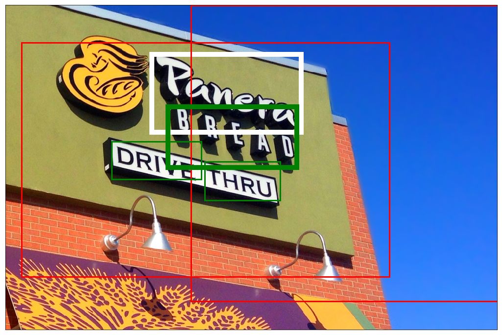

## Multi-Modal GNN for TextVQA

**_"What is the name of the bread sold at the place?"_**  
**_"Panera"_**

+ This project provides codes to reproduce the results on TextVQA shown in 
[the MM-GNN paper](https://www.google.com/).  
+ Grateful to [Pythia](https://github.com/facebookresearch/pythia "Pythia's Github repo"), an 
excellent VQA codebase provided by Facebook, on which our codes are developed.
+ We achieved 32.46% accuracy (ensemble) on test set of TextVQA

### set up data

+ To boost data loading speed under limited memory size (64G) and to speed up calculation
, we cached intermediate dataloader results in storage
+ download [data](https://drive.google.com/drive/folders/1Y8E-afg9aRHn6VblSWGNd0hvQGEW9ILS?usp=sharing) 
*(round 54G, and round 120G unzipped)*, and modify 
line 11 (`fast_dir`) in [config](pythia/common/defaults/configs/tasks/vqa/textvqa.yml)
to the absolute path of where you save them
+ download other files needed (vocabulary, OCRs, some parameters of 
backbone) [here](https://drive.google.com/file/d/1ieIx4MB49DBm1ycY203f15kvcrX4IoLt/view?usp=sharing) 
*(less than 1G)*, and make a soft link named `data`
in this repo towards where you saved them

### how to run

+ let's enter [ensemble](ensemble), where all our model parameters and results would be 
stored in each folder
+ let's create a new model folder, say `foo`, then copy [our config](configs/vqa/textvqa/s_mmgnn.yml) 
into it
+ back to repo root, then execute `python tools/run.py --tasks vqa --datasets 
textvqa --model s_mmgnn --config ensemble/foo/s_mmgnn.yml -dev cuda:0 --run_type train`
+ first-run of this repo will automatically download glove in `pythia/.vector_cache`, let's be patient
+ if we made it, we will find a `s_mmgnnbar_final.pth` in the model folder `foo`
+ then we execute under repo root `python tools/run.py --tasks vqa --datasets 
textvqa --model s_mmgnn 
--config ensemble/bar/s_mmgnn.yml --resume_file <path_to_pth> -dev cuda:0 --run_type all_in_one`
+ if we made it, we will find three new files generated under the model folder, those two 
ends with `evailai.p` are ready to be submitted to 
[evalai](https://evalai.cloudcv.org/web/challenges/challenge-page/244/leaderboard/809) to
view the results
+ a [trained](https://drive.google.com/file/d/1P1k3sNAQnV7dUovypt1zKwCTNgCEDHua/view?usp=sharing) model is provided